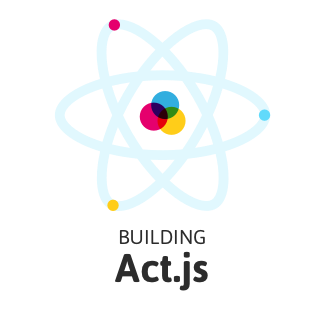

##### Learning React.js by Contstruction

### Handcraft your own version of React.js

**…To learn the core principles and ideas behind React.js**

This repository tries to give a **step-by-step tutorial** on how React.js
works and tries to convey it's core ideas.
        
There are a bunch of branches named <code>exericse-XX/topic</code> and 
<code>solution-XX/topic</code>. These indicate the different exericse and their solutions.

There will be a navigation at the bottom with two buttons to quickly
switch the branch holding the next exericse or the solution to the
current exericse. You can either use these buttons or manually switch
branches to your liking.

---

### Start the tutorial

`npm start`

Feel free to either checkout code-examples by switching branches to your liking

